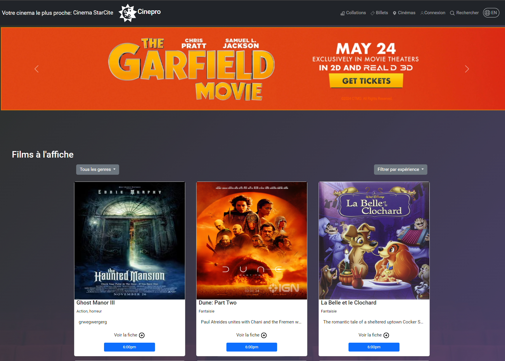
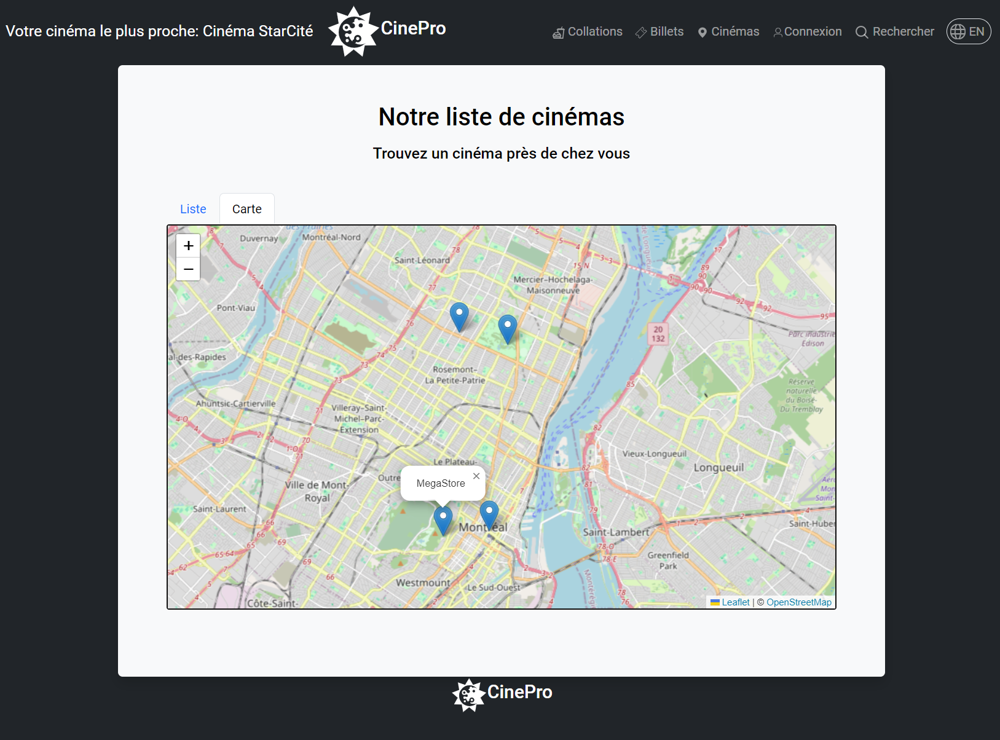
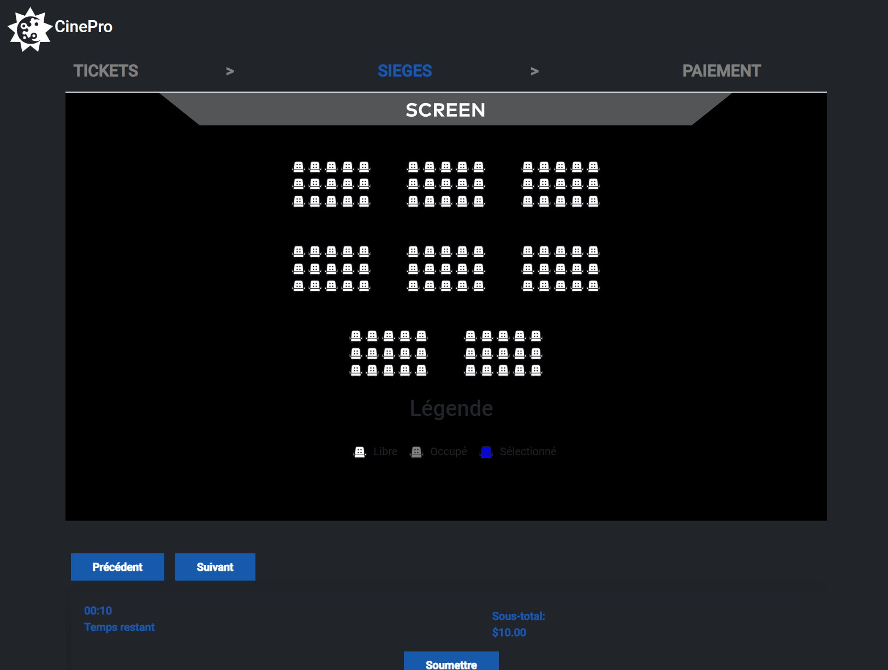
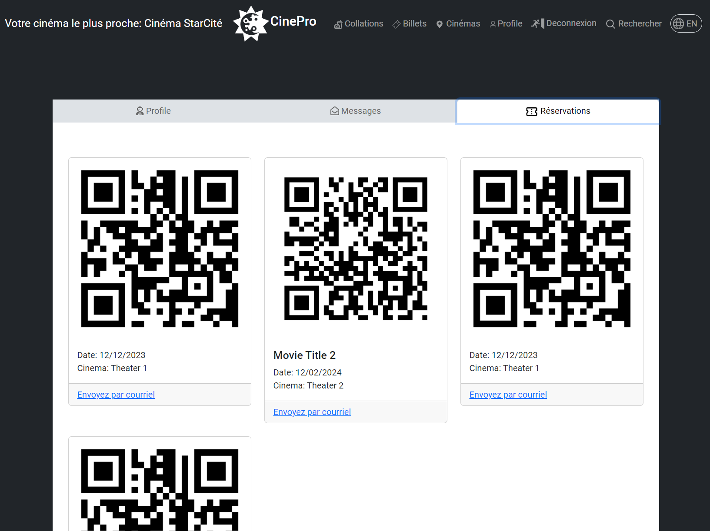
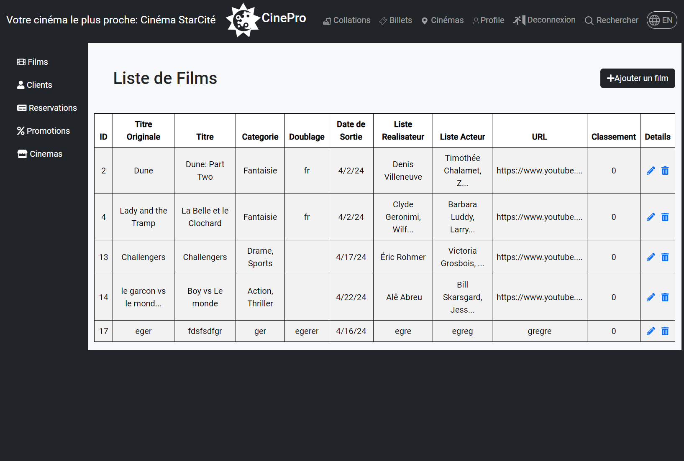

# CinePro

A full stack, fully mobile-friendly movie reservation app made with Spring, Bootstrap and Angular.



## Table of contents

- [CinePro](#cinepro)
  - [Table of contents](#table-of-contents)
  - [Overview](#overview)
    - [The project](#the-project)
    - [Utilisateur profile](#utilisateur-profile)
    - [Agentcinema and administrateur profiles](#agentcinema-and-administrateur-profiles)
      - [Screenshots](#screenshots)
  - [Technical Stack](#technical-stack)
  - [Local installation](#local-installation)
  - [Key features](#key-features)
  - [Future plans](#future-plans)
  - [Acknowledgments](#acknowledgments)
  - [Contributors](#contributors)

## Overview

### The project

Allo_Deneigement is a full-stack website platform that allow any visitor to browse currently aired movies in local movie theaters. Any visitor can get the location of all the theater locations and visualize the nearest location.

Three types of users excluding visitors can access the platform: regular users, customer service agents and administrators.

### Utilisateur profile

Once logged in, users can book seats for upcoming shows, handle their profiles and their reservations. Additionnally to movie tickets, customers can also book food items for takeout or deliveries at desire theater locations.

### Agentcinema and administrateur profiles

Customer services agents and administrators have access to a private dashboard. Agents can read and modify reservations and get access to all informations on users, movie threaters, movies and bookings. Administrators have all rights and can create, modify or delete any of those entities. The backend of the application is a REST API made to handle any required CRUD operators for each profiles, depending on authorization and authentication.

#### Screenshots

Theater map :



Seat booking page:



User profile:



Admin dashboard :



## Technical Stack

Built With

- Frontend
  - [Angular](https://angular.io/)
  - [Material Angular](https://material.angular.io/)
  - [Bootstrap 5](https://getbootstrap.com/)
- Backend
  - [Spring](https://spring.io/)
- Database
  - [MySQL](https://www.mysql.com/)
- Geolocation
  - [Leaflet](https://leafletjs.com/)
- Image storage
  - [Cloudinary](https://cloudinary.com/)
- Payment system
  - [Stripe](https://stripe.com/)
- Documentation
  - Swagger UI, OpenAPI 3

## Local installation

A working Cloudinary account is required to store images, as well as a fonctional MySQL database for overall data storage :

```
spring.application.name=back-cinepro

# Cloudinary info (disponible dans le dashboard sur Cloudinary.com):
CLOUDINARY_NAME=YOUR_CLOUDINARY_NAME
CLOUDINARY_KEY=YOUR_CLOUDINARY_KEY
CLOUDINARY_SECRET=YOUR_CLOUDINARY_SECRET

#Spring Security info:
application.security.jwt.secret-key=YOUR_SECRET_KEY
# will expire in one day :
application.security.jwt.expiration=86400000
# will expire in 7 days :
application.security.jwt.refresh-token.expiration=604800000

#logging.level.org.springframework=DEBUG

spring.datasource.url = jdbc:mysql://localhost:3306/cinepro_db
spring.datasource.username = your_db_username
spring.datasource.password =your_db_password
spring.jpa.show-sql = true
spring.jpa.hibernate.ddl-auto = update

```

The secret key can be of any format (We used a HMAC-SHA256 code).

1. Create a database `cinepro_db` in MySQL (to use a different relational database, you will need to update the `pom.xml` file accordingly).

2. Once the configuration file is ready, run the backend in your preferred IDE (default server for Spring is Tomcat at `http://localhost:8080/`). All endpoints can be accessed via Swagger at `http://localhost:8080/swagger-ui.html`.

PS: All the services and models can be autogenerated with a OpenAPI Specification (OAS) `json`file. The file is autogenerated at `http://localhost:8080/v3/api-docs` (more information [here](https://swagger.io/specification/)).

3. For the frontend, it was generated with [Angular CLI](https://github.com/angular/angular-cli) version 17.2.2.Run `ng serve` for a developement server. The front will run at `http://localhost:4200/` by default.

Run `npm install` the first time to install all the required packages in the `node_modules` folder.

The application will automatically reload if you change any of the source files.

4. For the geolocalisation to work, you need to enable the option in your browser. Otherwise, only the locations of the movie theaters will be display.

With that, you are all set!

## Key features

- Spring Security (JWT authentication)
- RESTful API
- Cloudinary usage for smooth image handling
- Stripe for payment validation
- Angular DOM Sanitizer for protection against XSS and CSRF attacks

## Future plans

- Improve UI (pagination, search functions, etc)
- Chat system implementation
- Google account authentication
- Email upon registration
- Validation code and Double-factor authentication
- Implement rebate point system
- Live deployment
- Add an english translation of the app

## Acknowledgments

- Original project idea by Amine Fahmi

## Contributors

- Doupamby Tity
- [Cylia Oudiai](https://www.linkedin.com/in/cylia-oudiai-81b7891a0/)
- [Emilie Echevin](https://www.linkedin.com/in/emilie-echevin/)
